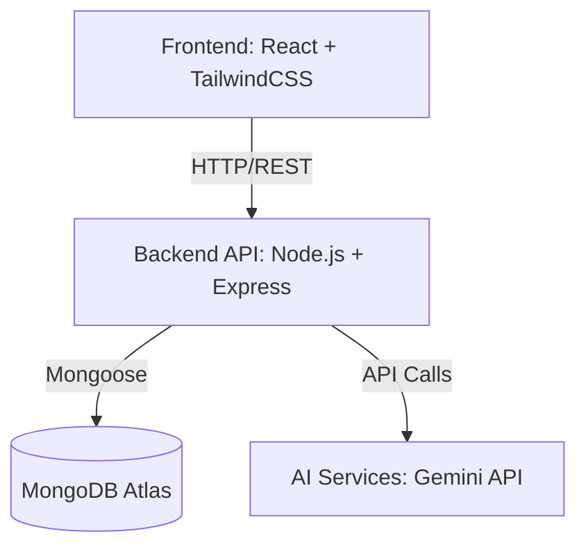

# Dharma System Architecture

This document explains the architecture and data flow of the Dharma project management platform. Our goal is to keep the architecture simple, monolithic, and accessible to beginner developers while maintaining professional standards.

## Overview

Dharma uses the **MERN** stack (MongoDB, Express, React, Node.js) with added integrations for Artificial Intelligence via the Gemini API.

### 1. Frontend
- Built with **React** and styled using **TailwindCSS**.
- Handles all user interactions, UI rendering, Kanban boards, and the command palette.
- State is managed simply, and API calls are made directly to the Backend API.

### 2. Backend
- Built on **Node.js** and **Express**.
- Serves as a monolithic backend processing business logic.
- Implements layered architecture (Routes → Controllers → Services → Models) to keep concerns separated while remaining easy to understand.
- Handles authentication, handles standard CRUD operations for tasks and projects, and runs the automation rule engine.

### 3. Database
- Hosted on **MongoDB Atlas**.
- Uses Mongoose schemas for structured data modeling (e.g., User, Project, Task, AutomationRule).

### 4. AI Integration
- Integrates with the **Gemini API**.
- Driven by the backend, which formats prompts and queries the Gemini API for features such as "AI task generation".

## Key Workflows

### Task Flow
1. User interacts with the UI to create a task.
2. The React frontend sends an HTTP `POST /api/tasks` request to the backend.
3. The Express controller validates the data and uses a Mongoose model to save it to MongoDB.
4. On success, the backend returns the new task, and the frontend updates the Kanban board.
5. If the AI assistant generated the task, the backend queries Gemini before saving the task to the database.

### Automation Rule Engine
The automation rule engine operates entirely on the backend to execute custom triggers and actions.
- **Trigger**: An event occurs (e.g., a task's status changes to "Done").
- **Evaluation**: The backend checks if any automation rules belong to the project and match this trigger.
- **Action**: The backend executes the defined logic (e.g., sending a notification, or creating a sub-task).

---
*Keep it clean, professional, and easy to understand!*
